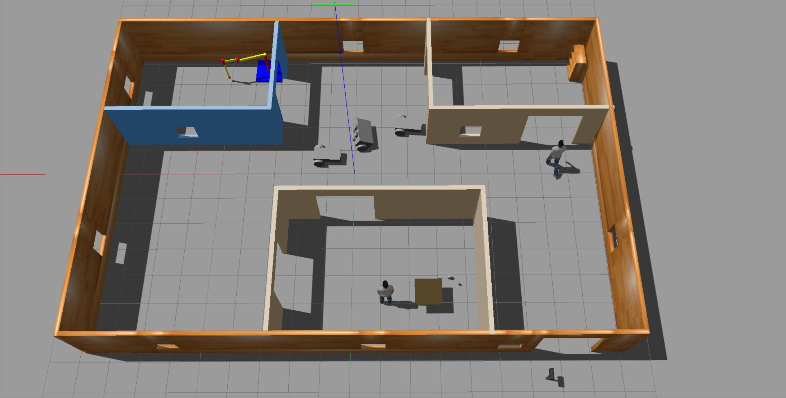

# Robotics_Build_My_World
Project #1 Build My World for [Robotics Software Engineer Nanodegree Program](https://www.udacity.com/course/robotics-software-engineer--nd209)



## Overview
The purpose of this project is to create a Gazebo world for the robot to be deployed into. This world will not only include the robot, but also the building and any other object that was created using the Model Editor. The project also includes a C++ plugin that prints "Welcome to Jordan's World!" on the terminal.

## Directory Description 
```     
    .Robotics_Build_My_World           # Build My World Project 
    ├── model                          # Model files 
    │   ├── mybuiding
    │   │   ├── model.config
    │   │   ├── model.sdf
    │   ├── robot_1
    │   │   ├── model.config
    │   │   ├── model.sdf
    │   ├── robot_1_0
    │   │   ├── model.config
    │   │   ├── model.sdf
    │   ├── robot_2
    │   │   ├── model.config
    │   │   ├── model.sdf
    ├── script                         # Gazebo World plugin C++ script      
    │   ├── myplugin.cpp               # Welcome message
    ├── world                          # Gazebo main World containing models 
    │   ├── my_world.world
    ├── CMakeLists.txt                 # Link libraries 
                                  
